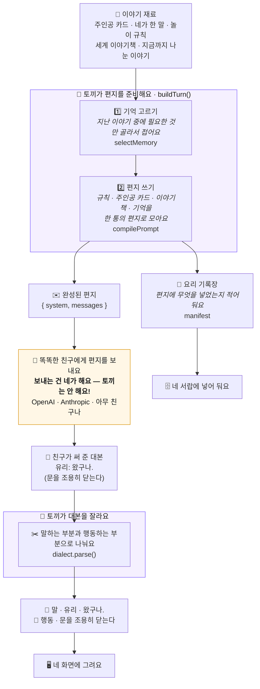
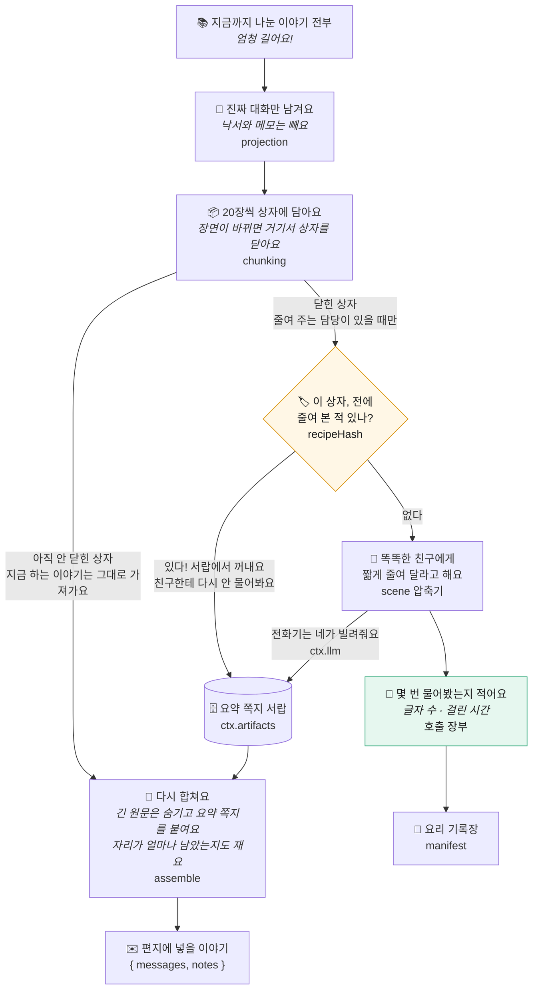

# rabbit-engine

LLM 롤플레잉 대화 엔진 — 대본 문법 · 프롬프트 조립 · 기억 층. 모델은 부르지 않는다.

아직 만드는 중이다. 공개 API 는 `v0.1.0` 전까지 예고 없이 바뀐다.

## 한 턴의 흐름

엔진은 LLM 호출의 앞과 뒤에만 관여한다. 앞에서는 `buildTurn()` 이 요청을 만들고, 뒤에서는 방언이 모델이 쓴 대본을 조각으로 나눈다. 호출 자체는 당신의 코드가 한다.

## 기억 층

긴 이력은 고정된 청크로 잘라 닫힌 청크만 요약한다. 같은 재료로 만든 요약은 `recipeHash` 로 캐시에서 꺼내므로 LLM 을 다시 부르지 않고, 부른 호출은 전부 manifest 의 장부에 남는다. 요약에 쓰는 LLM 도 엔진이 직접 부르지 않는다 — 당신이 `ctx.llm` 으로 건넨 호출자를 쓴다.

