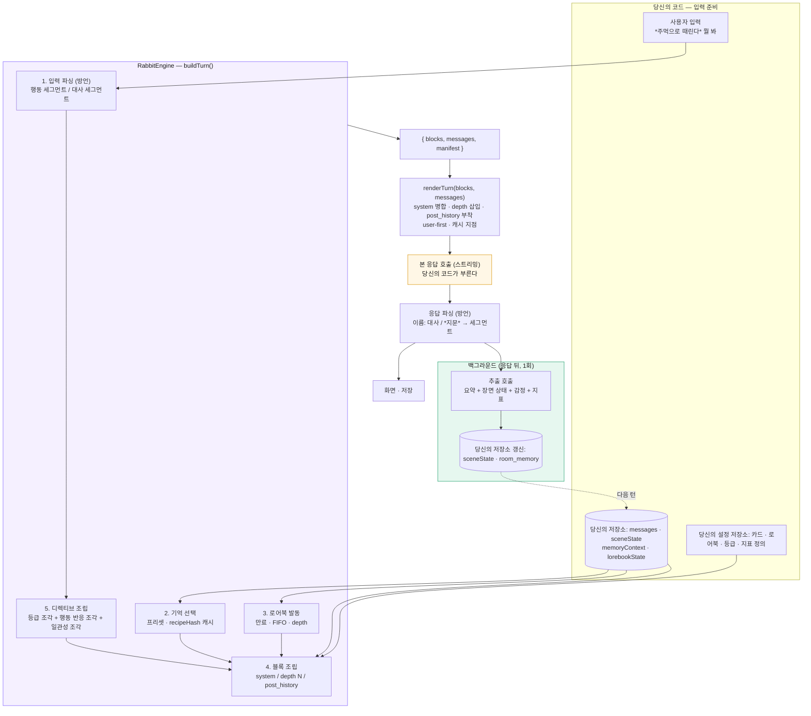
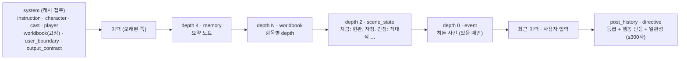
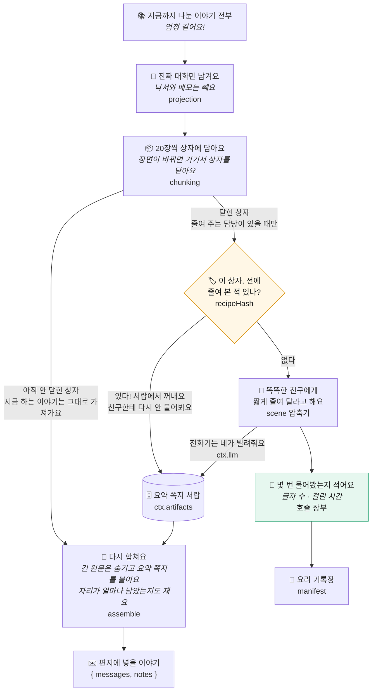

# rabbit-engine

LLM 롤플레잉 대화 엔진 — 대본 문법 · 프롬프트 조립 · 기억 층. 모델은 부르지 않는다.

아직 만드는 중이다. 공개 API 는 `v0.1.0` 전까지 예고 없이 바뀐다.

## 한 턴의 흐름

엔진은 LLM 호출의 앞과 뒤에만 관여한다. 앞에서는 `buildTurn()` 이 위치가 있는 블록 목록(`{ blocks, messages, manifest }`)을 만들고, `render()`(=`renderTurn`)가 그걸 공급자에 넣을 `{ system, messages }` 로 펼친다. 뒤에서는 방언이 모델이 쓴 대본을 조각으로 나누고, 응답이 끝난 뒤 한 번 더 작은 모델을 불러 장면 상태를 갱신한다. 모델 호출 자체는 항상 당신의 코드가 한다.



프롬프트에 실리는 순서(기본 배치):



### buildTurn 입력

| 입력 | 의미 |
|---|---|
| `rating` | `'all' \| 'teen' \| 'adult'`. 묘사 수위 — instruction·directive 문구를 바꾼다 |
| `sceneState` | 장면 상태 객체(`scene/state.js`). 있으면 depth 2 에 산문으로 렌더돼 들어간다 |
| `indicatorDefs` | 작품별 지표 정의. `sceneState` 렌더와 추출 스키마 둘 다에 쓰인다 |
| `userInput` | 이번 턴 사용자 입력. 기억 선택·로어북 스캔엔 보이고, 행동/대사 분석과 디렉티브의 재료가 된다 |
| `memoryNotes` | 기억 층이 고른 요약 노트. depth 4 `memory` 블록으로 들어간다 |
| `events` | 당신의 코드가 넣는 히든 사건. depth 0 `event` 블록으로 들어간다 |
| `pacing` | `'slow' \| 'normal' \| 'eventful'`. instruction 블록 뒤에 별도 system 블록으로 붙는다 |
| `continuing` | `true` 면 디렉티브의 "행동 시도" 조각을 뺀다 (재생성 등, 이미 처리한 턴) |
| `worldbookDepth` | 로어북 항목이 발동했을 때 넣을 depth. 없으면 system 접두에 들어간다 |

### 사용 예

```js
import { buildTurn, asteriskScript, extractionRecipe, applyExtraction } from 'rabbit-engine'

const ctx = { artifacts: store, llm: yourSummaryLlm }                 // 기억 요약·추출에 쓸 호출자

const turn = await buildTurn(
  { cards, messages, rating: 'teen', sceneState, indicatorDefs, userInput, memoryNotes, dialect: asteriskScript },
  ctx,
)
const { system, messages: rendered } = turn.render({ userFirst: true })
const replyText = await callYourLLM({ system, messages: rendered })   // 호출은 당신이 한다

const segments = asteriskScript.parse(replyText)                      // 대사 / 행동 세그먼트
await saveToUI(segments)

const recipe = extractionRecipe({ state: sceneState, exchanges: [{ user: userInput, assistant: replyText }], names, indicatorDefs })
const raw = await ctx.llm(recipe)                                     // 작은 모델로 사실만 추출
const next = applyExtraction(sceneState, raw, { indicatorDefs, expectedRevision: sceneState.revision })
if (!next.stale) await saveSceneState(next.state)                     // CAS: revision 이 어긋나면 버린다
```

## 기억 층

긴 이력은 고정된 청크로 잘라 닫힌 청크만 요약한다. 같은 재료로 만든 요약은 `recipeHash` 로 캐시에서 꺼내므로 LLM 을 다시 부르지 않고, 부른 호출은 전부 manifest 의 장부에 남는다. 요약에 쓰는 LLM 도 엔진이 직접 부르지 않는다 — 당신이 `ctx.llm` 으로 건넨 호출자를 쓴다.



## 기억 프리셋

`buildTurn({ memory: { preset: '…' } })` 로 고른다. 없으면 `legacy-full`(이력 전부).

| 프리셋 | 압축 | 접기 | 검색 | 밖에서 받는 것 |
|---|---|---|---|---|
| `lorebook` | — | — | — | — |
| `vector` | — | — | 글자 bigram | — |
| `semantic` | — | — | 임베딩 코사인 | `ctx.embed` |
| `memory-books` | 닫힌 씬 → 요약 | — | — | `ctx.llm` |
| `memory-books-tiered` | 닫힌 씬 → 요약 | 오래된 요약 → 줄거리 | — | `ctx.llm` |
| `semantic-books` | 닫힌 씬 → 요약 | 오래된 요약 → 줄거리 | 요약 중 닿는 것만 | `ctx.llm` · `ctx.embed` |
| `legacy-*` | — | — | (`legacy-retrieval` 만 bigram) | — |

**접기(digest)** 는 이진 카운터처럼 돈다. 최근 `keepLeaves` 개 씬 요약은 그대로 두고, 그보다 오래된 것을 앞에서부터 `fanout` 개씩 묶어 줄거리 하나로 접는다. 줄거리가 `fanout` 개 모이면 또 접는다. 묶음 경계가 0번 씬부터 고정이라 새 씬이 닫혀도 이미 만든 줄거리의 재료는 안 바뀌고, 캐시 키는 자식 요약의 `contentHash` 목록이라 옛 대사를 고치면 그 조상만 다시 만든다.

**검색(embedding)** 은 창 안의 마지막 유저 발화를 질의로 삼는다. `semantic` 은 창 밖 원문을, `semantic-books` 는 요약 산출물을 후보로 본다 (줄거리는 점수와 무관하게 항상 넣는다 — `keepKinds`). 벡터는 산출물 저장소에 본문 해시로 캐시되므로 같은 대사를 두 번 임베딩하지 않는다.

```js
const turn = await buildTurn(
  { cards, messages, memory: { preset: 'semantic-books' } },
  {
    artifacts: store,                       // 요약·줄거리·벡터 캐시. 없으면 매 턴 새로 만든다
    scope: 'session', scopeId: sessionId,
    llm: async ({ system, messages, model, maxTokens }) => { /* 요약 모델 호출 */ },
    embed: async ({ texts, model }) => ({ vectors: /* texts 와 같은 길이 */ [], usage: { input: 0 } }),
  },
)
turn.manifest.memoryCalls          // 이 턴이 산 호출 전부 — purpose: 'compact' | 'reduce' | 'embed'
turn.manifest.retrievalScores      // 무엇을 왜 골랐는지
```

## 평가

`eval/README.md` 를 봐라. `eval/scenarios/*.json` 의 결정론 검사(블록·디렉티브·system 조립)는 `npm test` 에 포함된다. 실제 응답 품질은 `node scripts/eval-judge.js --variant full|no-directive|no-state` 로 수동 실행한다 — 모델 키(`OPENAI_API_KEY`/`ANTHROPIC_API_KEY`)가 필요하고 `npm test` 에는 없다.
